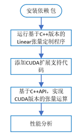

---

typora-copy-images-to: ..\img
typora-root-url: ./
---

# Lab 3 - CUDA实现和优化

## 实验目的

1.	理解DNN框架中的张量运算在GPU加速器上加速原理。
2.	通过CUDA实现和优化一个定制化张量运算。

## 实验环境

* PyTorch==1.5.0

* CUDA 10.0

## 实验原理

1. CUDA 的线程层次

   Grid: 一维、二维或三维的线程块 (Block)

   Block: 一组一维、二维或三维的线程

   同一个 Grid 中，每个 block 的线程数 (即 block 的 shape) 是相同的。一个 block 最多可以有 1024 个线程。

   同一个 block 内部的每个线程可以

   - 同步 synchronize
   - 访问共享存储器 shared memory

   一个 SM 可以存放一个或多个 block，一个 block 只能放在同一个 SM 中。

   

   

2. CUDA 的存储结构

   Global memory 最大，但读写速度慢

   Constant memory 为只读内存

   Register, Local memory 和 Shared memory 速度接近，非常快。

   

3. GPU加速器的加速原理

## 实验内容

### 实验流程图



### 具体步骤

1.	理解PyTorch中Linear张量运算的计算过程，推导计算公式

2.	了解GPU端加速的原理，CUDA内核编程和实现一个kernel的原理

3.	实现CUDA版本的定制化张量运算

    1. 编写.cu文件，实现矩阵相乘的kernel
      
    2. 在上述.cu文件中，编写使用cuda进行前向计算和反向传播的函数
      
    3. 基于C++ API，编写.cpp文件，调用上述函数，实现Linear张量运算的前向计算和反向传播。

    4. 将代码生成python的C++扩展

    5. 使用基于C++的函数扩展，实现自定义Linear类模块的前向计算和反向传播函数

    6. 运行程序，验证网络正确性

4.	使用profiler比较网络性能：基于C++API，比较有无CUDA对张量运算性能的影响

5.	【可选实验，加分】实现基于CUDA的卷积层（Convolutional）自定义张量运算

## 实验报告

### 实验环境

||||
|--------|--------------|--------------------------|
|硬件环境|CPU（vCPU数目）|Intel(R) Xeon(R) E5-2680 v4 |
||GPU(型号，数目)|NVIDIA GeForce RTX 2060|
|软件环境|OS版本|Ubuntu 20.04.3 LTS|
||深度学习框架<br>python包名称及版本|PyTorch 1.10.0|
||CUDA版本|11.3|
||||

### 实验结果

使用以下代码测试矩阵乘法 kernel 的性能：

```c++
int main()
{
    float *input, *weights, *output;

    const int M = 1 << 10;
    const int K = 1 << 10;
    const int N = 1 << 10;

    cudaMallocManaged(&input, M * K * sizeof(float));
    cudaMallocManaged(&weights, K * N * sizeof(float));
    cudaMallocManaged(&output, M * N * sizeof(float));

    int sz_input = M * K;
    int sz_weights = K * N;
    int sz_output = M * N;

    // initialize input, weights and output
    for (int i = 0; i < sz_input; ++i) {
        input[i] = 1.0f;
    }

    for (int i = 0; i < sz_weights; ++i) {
        weights[i] = 2.0f;
    }

    for (int i = 0; i < sz_output; ++i) {
        output[i] = 0.0f;
    }

    const dim3 threadsPerBlock(BLOCK_SIZE, BLOCK_SIZE);
    const dim3 numBlocks((M - 1) / BLOCK_SIZE + 1, (N - 1) / BLOCK_SIZE + 1);
    matmul_kernel<<<numBlocks, threadsPerBlock>>>(input, weights, output, M, K, N);

    // Wait for GPU to finish before accessing on host
    cudaDeviceSynchronize();

    float error = 0.0f;
    for (int i = 0; i < sz_output; ++i) {
        error += abs(output[i] - 2.0f * K);
    }

    std::cout << "Error: " << error << std::endl;
    
    return 0;
}
```

原始代码：

```c++
template <typename scalar_t>
__global__ void matmul_kernel(
    const scalar_t* A,
    const scalar_t* B,
    scalar_t* C,
    const int M, 
    const int K, 
    const int N,
    const bool trans_A = false,
    const bool trans_B = false) 
{
    const int row = blockIdx.x * blockDim.x + threadIdx.x;
    const int col = blockIdx.y * blockDim.y + threadIdx.y;
    if (row < M && col < N)
    {
        scalar_t sum = 0.0;
        for (int k = 0; k < K; k++)
        {
            const int i = trans_A ? (k * M + row) : (row * K + k);
            const int j = trans_B ? (col * K + k) : (k * N + col);
            sum += A[i] * B[j];
        }

        C[row * N + col]  = sum;
    }
}
```

使用 `nvprof` 查看执行时间：

```
root@container-f97d11abac-f410178f:~/CUDA-implementation/lab/mylinear_cuda_extension# nvprof ./test
==228429== NVPROF is profiling process 228429, command: ./test
Error: 0
==228429== Profiling application: ./test
==228429== Profiling result:
            Type  Time(%)      Time     Calls       Avg       Min       Max  Name
 GPU activities:  100.00%  39.536ms         1  39.536ms  39.536ms  39.536ms  void matmul_kernel<float>(float const *, float const *, float*, int, int, int, bool, bool)
...
```

效率低的原因：访问 global memory，时间开销大。

优化：将每个 block 需要用到的数据加载到 shared memory 中。

使用 `__shared__` 在 shared memory 中保存分块矩阵 `As` 和 `Bs`，分块的大小为 BLOCK_SIZE * BLOCK_SIZE，如下图所示：


每个 thread 总 global memory 访问次数

优化前 2 * K 次

优化后 2 * K / BLOCK_SIZE 次

优化后代码：

```C++
template <typename scalar_t>
__global__ void matmul_kernel(
    const scalar_t* A,
    const scalar_t* B,
    scalar_t* C,
    const int M, 
    const int K, 
    const int N,
    const bool trans_A = false,
    const bool trans_B = false) 
{
    const int row = blockIdx.x * blockDim.x + threadIdx.x;
    const int col = blockIdx.y * blockDim.y + threadIdx.y;
    const int blockRow = threadIdx.x;
    const int blockCol = threadIdx.y;

    if (row < M && col < N) {
        __shared__ float As[BLOCK_SIZE][BLOCK_SIZE];
        __shared__ float Bs[BLOCK_SIZE][BLOCK_SIZE];

        int val = 0;

        for (int s = 0; s < K; s += BLOCK_SIZE) {
            As[blockRow][blockCol] = (s + blockCol < K) ? (trans_A ? A[(s + blockCol) * K + row] : A[row * K + s + blockCol]) : 0;
            Bs[blockRow][blockCol] = (s + blockRow < K) ? (trans_B ? B[col * N + s + blockRow] : B[(s + blockRow) * N + col]) : 0;

            __syncthreads();  // make sure sub-matrices are loaded

            for (int k = 0; k < BLOCK_SIZE; ++k) {
                val += As[blockRow][k] * Bs[k][blockCol];
            }

            // make sure that the preceding computation is done before loading
            // two new sub-matrices of A and B in the next iteration
            __syncthreads();
        }

        C[row * N + col]  = val;
    }

}
```

使用 `nvprof` 查看执行之间：

```
root@container-377e11abac-d9186d76:~/CUDA-implementation/lab/mylinear_cuda_extension# nvprof ./test
==2129== NVPROF is profiling process 2129, command: ./test
Error: 0
==2129== Profiling application: ./test
==2129== Profiling result:
            Type  Time(%)      Time     Calls       Avg       Min       Max  Name
 GPU activities:  100.00%  15.717ms         1  15.717ms  15.717ms  15.717ms  void matmul_kernel<float>(float const *, float const *, float*, int, int, int, bool, bool)
...
```

可以看到，kernel 的执行时间由 39.536ms 减少到 15.717ms。


|||
|---------------|---------------------------|
| 实现方式（Linear层为例）| &nbsp; &nbsp; &nbsp; &nbsp; 性能评测 |
|<br/> <br/>CPU only<br/> <br/>&nbsp;|&nbsp; &nbsp; &nbsp; &nbsp; &nbsp; &nbsp; &nbsp; &nbsp; &nbsp; &nbsp; &nbsp; &nbsp; &nbsp; &nbsp; &nbsp; &nbsp; &nbsp; &nbsp; &nbsp; &nbsp; &nbsp; &nbsp; |
|<br/> <br/>With CUDA<br/> <br/>&nbsp;||
||||

## 参考代码

代码位置：`Lab3/mnist_custom_linear_cuda.py`

运行命令：
```
cd mylinear_cuda_extension
python setup install --user
cd ..& python mnist_custom_linear_cuda.p
```

## 参考资料

* CUDA Programming model: https://docs.nvidia.com/cuda/cuda-c-programming-guide/index.html 
* An Even Easier Introduction to CUDA: https://devblogs.nvidia.com/even-easier-introduction-cuda/ 
* CUSTOM C++ AND CUDA EXTENSIONS: https://pytorch.org/tutorials/advanced/cpp_extension.html
