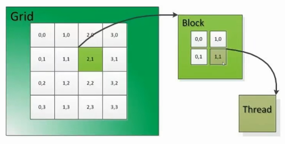
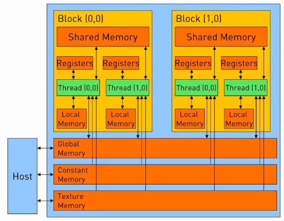

---

typora-copy-images-to: ../img
typora-root-url: ./
---

# Lab 3 - CUDA实现和优化

罗力信 @同济大学

## 实验目的

1.	理解DNN框架中的张量运算在GPU加速器上加速原理。
2.	通过CUDA实现和优化一个定制化张量运算。

## 实验环境

* PyTorch==1.5.0

* CUDA 10.0

## 实验原理

1. CUDA 的线程层次

   Grid: 一维、二维或三维的线程块 (Block)

   Block: 一组一维、二维或三维的线程

   同一个 Grid 中，每个 block 的线程数 (即 block 的 shape) 是相同的。一个 block 最多可以有 1024 个线程。

   同一个 block 内部的每个线程可以

   - 同步 synchronize
   - 访问共享存储器 shared memory

   一个 SM 可以存放一个或多个 block，一个 block 只能放在同一个 SM 中。

   

   

2. CUDA 的存储结构

   Global memory 最大，但读写速度慢

   Constant memory 为只读内存

   Register, Local memory 和 Shared memory 延迟低，速度块。

   

3. GPU加速器的加速原理

   GPU 加速的基本原理就是利用 GPU 中大量的线程，实现并行计算；同时利用大吞吐量，掩盖数据传输的延迟。因此，在 GPU 编程时，应尽可能利用 GPU 的并行性，同时减少访存操作的比例，以提高性能。

## 实验内容

### 实验流程图


### 具体步骤

1.	理解PyTorch中Linear张量运算的计算过程，推导计算公式

2.	了解GPU端加速的原理，CUDA内核编程和实现一个kernel的原理

3.	实现CUDA版本的定制化张量运算

    1. 编写.cu文件，实现矩阵相乘的kernel
      
    2. 在上述.cu文件中，编写使用cuda进行前向计算和反向传播的函数
      
    3. 基于C++ API，编写.cpp文件，调用上述函数，实现Linear张量运算的前向计算和反向传播。

    4. 将代码生成python的C++扩展

    5. 使用基于C++的函数扩展，实现自定义Linear类模块的前向计算和反向传播函数

    6. 运行程序，验证网络正确性

4.	使用profiler比较网络性能：基于C++API，比较有无CUDA对张量运算性能的影响

5.	【可选实验，加分】实现基于CUDA的卷积层（Convolutional）自定义张量运算

## 实验报告

### 实验环境

||||
|--------|--------------|--------------------------|
|硬件环境|CPU（vCPU数目）|Intel(R) Xeon(R) E5-2680 v4 |
||GPU(型号，数目)|NVIDIA Titan Xp|
|软件环境|OS版本|Ubuntu 20.04.3 LTS|
||深度学习框架<br>python包名称及版本|PyTorch 1.10.0|
||CUDA版本|11.3|
||||

### 实验结果

#### 基本实现

Linear 模块的核心，实际上就是矩阵的乘法运算，即 `matmul_kernel` 的实现。要利用 CUDA 实现矩阵的乘法运算，最直接的想法就是让每一个线程负责结果矩阵中的一个元素的计算。根据矩阵乘法的定义，矩阵 A 与 B 相乘，结果矩阵中的每个元素是 A 中的对应行与 B 中的对应列的乘累和。另外，由于 block 的大小不一定是矩阵的 size 的整数倍，分配的线程可能多于实际结果矩阵中的元素个数，因此需要进行越界判断。根据上述思路，实现如下：

```c++
__global__ void matmul_kernel(
    const float* A,
    const float* B,
    float* C,
    const int M, 
    const int K, 
    const int N,
    const bool trans_A = false,
    const bool trans_B = false) 
{
    const int row = blockIdx.x * blockDim.x + threadIdx.x;
    const int col = blockIdx.y * blockDim.y + threadIdx.y;
    if (row < M && col < N)
    {
        float sum = 0.0;
        for (int k = 0; k < K; k++)
        {
            const int i = trans_A ? (k * M + row) : (row * K + k);
            const int j = trans_B ? (col * K + k) : (k * N + col);
            sum += A[i] * B[j];
        }

        C[row * N + col]  = sum;
    }
}
```

我使用了以下代码来测试矩阵乘法 kernel 的性能：

```c++
int main()
{
    float *input, *weights, *output;

    const int M = 1 << 10;
    const int K = 1 << 10;
    const int N = 1 << 10;

    cudaMallocManaged(&input, M * K * sizeof(float));
    cudaMallocManaged(&weights, K * N * sizeof(float));
    cudaMallocManaged(&output, M * N * sizeof(float));

    int sz_input = M * K;
    int sz_weights = K * N;
    int sz_output = M * N;

    // initialize input, weights and output
    for (int i = 0; i < sz_input; ++i) {
        input[i] = 1.0f;
    }

    for (int i = 0; i < sz_weights; ++i) {
        weights[i] = 2.0f;
    }

    for (int i = 0; i < sz_output; ++i) {
        output[i] = 0.0f;
    }

    const dim3 threadsPerBlock(BLOCK_SIZE, BLOCK_SIZE);
    const dim3 numBlocks((M - 1) / BLOCK_SIZE + 1, (N - 1) / BLOCK_SIZE + 1);
    matmul_kernel<<<numBlocks, threadsPerBlock>>>(input, weights, output, M, K, N);

    // Wait for GPU to finish before accessing on host
    cudaDeviceSynchronize();

    float error = 0.0f;
    for (int i = 0; i < sz_output; ++i) {
        error += abs(output[i] - 2.0f * K);
    }

    std::cout << "Error: " << error << std::endl;
    
    return 0;
}
```

使用 `nvprof` 查看执行时间：

```
root@container-f97d11abac-f410178f:~/CUDA-implementation/lab/mylinear_cuda_extension# nvprof ./test
==228429== NVPROF is profiling process 228429, command: ./test
Error: 0
==228429== Profiling application: ./test
==228429== Profiling result:
            Type  Time(%)      Time     Calls       Avg       Min       Max  Name
 GPU activities:  100.00%  39.536ms         1  39.536ms  39.536ms  39.536ms  void matmul_kernel<float>(float const *, float const *, float*, int, int, int, bool, bool)
...
```

#### 利用 Shared Memory 优化

上述代码主循环中的乘加操作 `sum += A[i] * B[j]` 是直接访问 Global Memory。而访问 Global Memory 的时间开销非常大，其延迟远高于访问 Shared Memory 和寄存器的延迟。分析上面的 kernel 代码，可以发现 Global Memory 中的元素是被重复访问了。例如，计算结果矩阵的 (3, 3) 元素和 (3, 4) 元素都用到了 A 矩阵的第 3 行数据，在上述的 kernel 中，计算这两个元素的线程分别访问 Global Memory 来读取 A 矩阵的第 3 行数据。实际上，这两个元素是位于同一个 block 内的 (假设 block_size = 32)，相同的数据只需要 block 内的其中一个线程读入到 Shared Memory 中，其他的线程就可以从 Shared Memory 中读取了，而不需要从 Global Memory 中读取了。因此，可以把读取 Global Memory 的操作，分配到 block 内的各个线程，避免重复访问 Global Memory。首先需要对 A 和 B 进行分块，分成大小为 BLOCK_SIZE * BLOCK_SIZE 的子矩阵。这样，线程 (i, j) 就只需要将 A、B 的两个子矩阵中的 (i, j) 元素分别从 Global Memory 读取到 Shared Memory 中，如下图所示：


上述优化前后每个线程对 Global Memory 的访问次数：

- 优化前 2 * K 次

- 优化后 2 * K / BLOCK_SIZE 次

可以看到，优化后对 **Global Memory 的访问次数大幅减少**。

在编程时，使用 `__shared__` 声明变量可以将变量保存在 Shared Memory 中，声明的变量是由整个 block 内的所有线程共享的。这里，我们需要在 shared memory 中保存分块矩阵 `As` 和 `Bs`。当每个线程计算乘累和时，直接从 Shared Memory 中访问 `As` 和 `Bs`。

我们还需要保证，当子矩阵 `As` 和 `Bs` 都已经全部加载完成后，各个线程的计算才能开始。因此我们需要用到 `__syncthreads()` 来实现 **thread barrier**，即等待 block 内的所有线程执行到该点时，才能继续执行后面的计算操作。

优化后代码如下：

```C++
__global__ void matmul_kernel(
    const float* A,
    const float* B,
    float* C,
    const int M, 
    const int K, 
    const int N,
    const bool trans_A = false,
    const bool trans_B = false) 
{
    const int row = blockIdx.x * blockDim.x + threadIdx.x;
    const int col = blockIdx.y * blockDim.y + threadIdx.y;
    const int blockRow = threadIdx.x;
    const int blockCol = threadIdx.y;

    __shared__ float As[BLOCK_SIZE][BLOCK_SIZE];
    __shared__ float Bs[BLOCK_SIZE][BLOCK_SIZE];

    float val = 0;

    for (int s = 0; s < K; s += BLOCK_SIZE) {
        As[blockRow][blockCol] = (row < M && s + blockCol < K) ? (trans_A ? A[(s + blockCol) * K + row] : A[row * K + s + blockCol]) : 0;
        Bs[blockRow][blockCol] = (col < N && s + blockRow < K) ? (trans_B ? B[col * N + s + blockRow] : B[(s + blockRow) * N + col]) : 0;

        __syncthreads();  // make sure sub-matrices are loaded

        for (int k = 0; k < BLOCK_SIZE; ++k) {
            val += As[blockRow][k] * Bs[k][blockCol];
        }

        // make sure that the preceding computation is done before loading
        // two new sub-matrices of A and B in the next iteration
        __syncthreads();
    }

    if (row < M && col < N) {
        C[row * N + col]  = val;
    }
}
```

使用 `nvprof` 查看执行时间：

```
root@container-377e11abac-d9186d76:~/CUDA-implementation/lab/mylinear_cuda_extension# nvprof ./test
==51618== NVPROF is profiling process 51618, command: ./test
Error: 0
==51618== Profiling application: ./test
==51618== Profiling result:
            Type  Time(%)      Time     Calls       Avg       Min       Max  Name
 GPU activities:  100.00%  15.611ms         1  15.611ms  15.611ms  15.611ms  void matmul_kernel<float>(float const *, float const *, float*, int, int, int, bool, bool)
...
```

可以看到，kernel 的执行时间由 39.536ms 减少到 15.611ms，优化效果明显。

#### 使用向量化的访存优化

上面使用 Shared Memory 的优化大幅减少了 Global Memory 的访问次数，减少了访存时间开销。但是，上述 kernel 的计算循环中，

```c++
for (int k = 0; k < BLOCK_SIZE; ++k) {
    val += As[blockRow][k] * Bs[k][blockCol];
}
```

每一次循环由 2 次访存、1 次乘法和 1 次加法构成，访存指令占比 50%。尽管 Shared Memory 的访存延迟已经远低于 Global Memory，但上述代码的**访存比例仍然较高**，运算指令仍然无法“掩盖”访存延迟（运算指令远远快于访存指令）。因此，还需要继续优化，减少运算循环中的访存次数。

查阅 NVIDIA 的资料 (https://developer.nvidia.com/blog/cuda-pro-tip-increase-performance-with-vectorized-memory-access/) 发现，可以利用**向量化访存** (Vectorized Memory Access)，一次传输多个数据，从而减少访存次数。NVIDIA GPU 中的 LDS.128 指令可以一次传输 128 位的数据，因此可以一次将 4 个 32 位浮点数从 Shared Memory 读入到寄存器中。配合循环展开，这时每一次循环有 2 个访存指令和 8 个运算指令，访存指令比例降低至 20%。

为了实现一次传输 4 个浮点数，首先要将 `Bs` 转置，将子矩阵元素从 Global Memory 中的 `b` 读入 `Bs` 时的行列标对换，从而使原本同一列的数据的地址相邻，便于一次传输。在代码中，将 float 指针用 `reinterpret_cast` 转换为 CUDA 内建的 float4 类型指针，实现 4 个 float 型数据一并传输。 

```c++
__global__ void matmul_kernel(
    const float* A,
    const float* B,
    float* C,
    const int M, 
    const int K, 
    const int N,
    const bool trans_A = false,
    const bool trans_B = false) 
{
    const int row = blockIdx.x * blockDim.x + threadIdx.x;
    const int col = blockIdx.y * blockDim.y + threadIdx.y;
    const int blockRow = threadIdx.x;
    const int blockCol = threadIdx.y;

    __shared__ float As[BLOCK_SIZE][BLOCK_SIZE];
    __shared__ float Bs[BLOCK_SIZE][BLOCK_SIZE];

    float Ar[4], Br[4];  // registers

    float val = 0.0f;

    for (int s = 0; s < K; s += BLOCK_SIZE) {
        As[blockRow][blockCol] = (row < M && s + blockCol < K) ? (trans_A ? A[(s + blockCol) * K + row] : A[row * K + s + blockCol]) : 0;
        Bs[blockCol][blockRow] = (col < N && s + blockRow < K) ? (trans_B ? B[col * N + s + blockRow] : B[(s + blockRow) * N + col]) : 0;

        __syncthreads();  // make sure sub-matrices are loaded

        for (int k = 0; k < BLOCK_SIZE; k += 4) {
            *(reinterpret_cast<float4*>(Ar)) = *(reinterpret_cast<float4*>(&As[blockRow][k]));
            *(reinterpret_cast<float4*>(Br)) = *(reinterpret_cast<float4*>(&Bs[blockCol][k]));

            #pragma unroll 4
            for (int i = 0; i < 4; ++i) {
                val += Ar[i] * Br[i];
            }
        }

        // make sure that the preceding computation is done before loading
        // two new sub-matrices of A and B in the next iteration
        __syncthreads();
    }

    if (row < M && col < N) {
        C[row * N + col]  = val;
    }
}
```

使用 `nvprof` 查看执行时间：

```
root@container-377e11abac-dc3b0a23:~/CUDA-implementation/lab/mylinear_cuda_extension# nvprof ./test
==36883== NVPROF is profiling process 36883, command: ./test
Error: 0
==36883== Profiling application: ./test
==36883== Profiling result:
            Type  Time(%)      Time     Calls       Avg       Min       Max  Name
 GPU activities:  100.00%  9.8165ms         1  9.8165ms  9.8165ms  9.8165ms  void matmul_kernel<float>(float const *, float const *, float*, int, int, int, bool, bool)
...
```

可以看到，使用向量化访存优化后，性能得到了进一步的提高。

#### MNIST 数据集上的性能测试

由于用作生成 CUDA 扩展的 kernel 函数为模板函数，矩阵的数据类型不确定。因此生成 CUDA 扩展时仅使用了 Shared Memory 优化的 kernel，未使用向量化访存优化。

| 实现方式（Linear层为例）| 性能评测                                                     |
|---------------|---------------------------|
|CPU only|Time: 286.77 s (1 epoch) |
|With CUDA (使用 `nn.Linear`)|Time: 17.50 s (1 epoch)<br />Test set: Average loss: 0.0285, Accuracy: 9913/10000 (99%)|
|With CUDA (使用自定义的 Linear 层)|Time: 17.54 s (1 epoch)<br />Test set: Average loss: 0.0257, Accuracy: 9916/10000 (99%)|

## 运行命令

```
cd mylinear_cuda_extension
python setup install --user
cd ..
python mnist_custom_linear_cuda.py
```

## 参考资料

* CUDA Programming model: https://docs.nvidia.com/cuda/cuda-c-programming-guide/index.html 
* An Even Easier Introduction to CUDA: https://devblogs.nvidia.com/even-easier-introduction-cuda/ 
* CUSTOM C++ AND CUDA EXTENSIONS: https://pytorch.org/tutorials/advanced/cpp_extension.html
